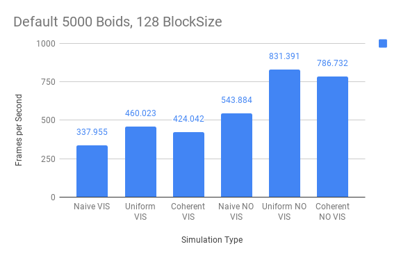
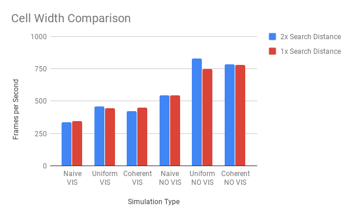

**University of Pennsylvania, CIS 565: GPU Programming and Architecture,
Project 1 - Flocking**

## Flocking with CUDA on the GPU
### Connie Chang
  * [LinkedIn](linkedin.com/in/conniechang44), [Demo Reel](vimeo.com/ConChang/DemoReel)
* Tested on: Windows 10, Intel Xeon CPU E5-1630 v4 @ 3.70 GHz, GTX 1070 8GB (SIG Lab)

This project consists of three different algorithms for flocking, and a performance analysis.

10,000 particles flocking together

Screenshot of 5,000 particles

The three algorithms are:  
* Naive: Querying every particle to find close neighbors.
* Uniform Grid: Breaking the space into voxels, and only checking nearby voxels.
* Coherent Uniform Grid: The same as Uniform Grid, but with structuring particle data as contiguously as possible  

A graph comparing the performance of each algorithm.  
  
  

A graph comparing the number of particles (boids).  
  
  
  
A graph comparing the number of threads per block.  
  
  
  
A graph comparing the uniform grid's cell width, relative to the neighbor search distance.  
  

Performance Questions and Answers: 
-----------------------
*For each implementation, how does changing the number of boids affect performance? Why do you think this is?*  

**Naive**: Increasing boids slows down the simulation. This makes sense because the algorithm takes more time to search through every boid.  
**Uniform Grid**: Surprisingly, performance gets better as the number of boids increases. I've heard that GPUs can perform faster when larger blocks of threads are used. My guess is that's why my results are like so.  
**Coherent**: Similar to uniform grid, the performance increases as the number of boids increases.  
  
*For each implementation, how does changing the block count and block size affect performance? Why do you think this is?*  

*For the coherent uniform grid: did you experience any performance improvements with the more coherent uniform grid? Was this the outcome you expected? Why or why not?*  

*Did changing cell width and checking 27 vs 8 neighboring cells affect performance? Why or why not? Be careful: it is insufficient (and possibly incorrect) to say that 27-cell is slower simply because there are more cells to check!*  
